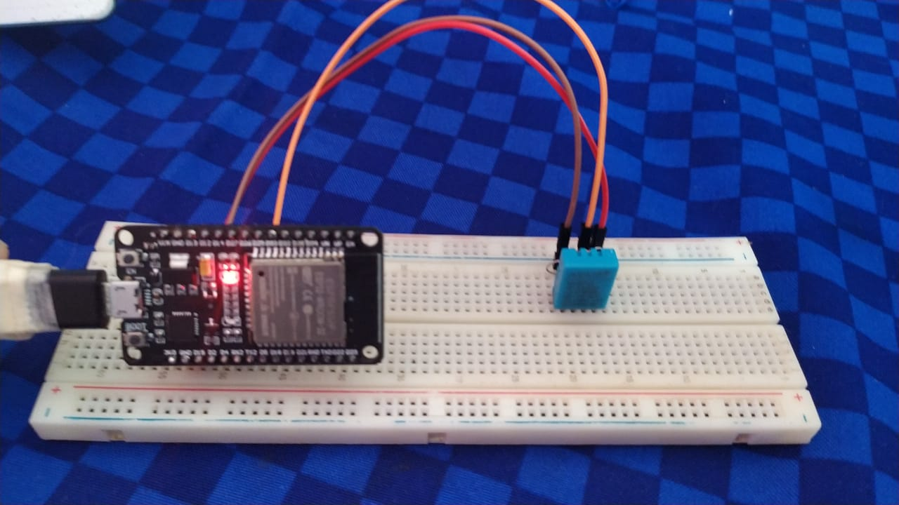

# Projeto final
Repositório do projeto Final da disciplina Fundamentos de Sistemas Embarcados, UNB.

Enunciado do projeto disponivel em: https://gitlab.com/fse_fga/projetos_2020_2/trabalho-final-2020-2

**Nome**: João Pedro Soares Cirqueira
**Matrícula**: 150132344

**Nome**: Moacir Mascarenha Soares Junior
**Matrícula**: 170080366

## Sistema



### Requisitos

#### client-esp32
- Possui a extensão PlataformIO no Visual Studio Code.
- Sensor dht11 conectado.
- esp32 conectada ao computador

#### Servidor central
- Possuir node versão 14.16 ou superior.

## Executando o projeto

### executando ESP-32

```sh
$ git clone https://github.com/MoacirMSJ/FSE_Trabalho_Final.git
$ cd FSE_Trabalho_Final/client-esp32/
$ abrir o projeto no plataformIo
$ mudar as configurações de wifi no arquivo src/Kconfig.projbuild
$ executar o plataformIo build
$ executar o upload and monitor
```

### executando Servidor Central

```sh
$ git clone https://github.com/MoacirMSJ/FSE_Trabalho_Final.git
$ cd FSE_Trabalho_Final/servidor-central
$ npm install
$ npm start
$ acesse http://localhost:3000/
```

## Video 

[video](https://youtu.be/xj580qneWUU)


## Observações
 Para cada comodo cadastrado é possivel obter um arquivo csv com os logs.
